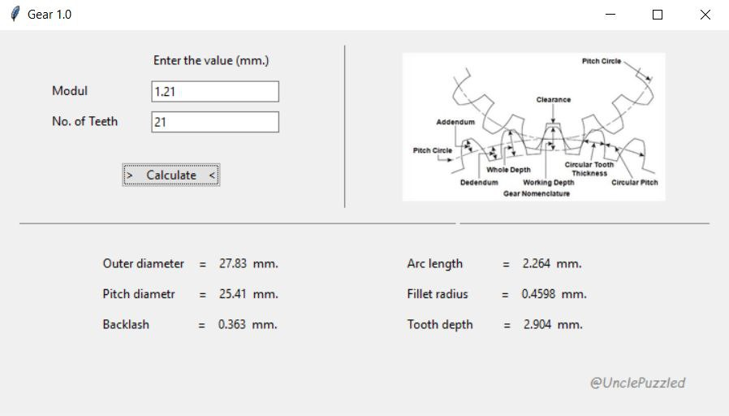

Many CAD systems allow creating geometries for gears, racks, etc., but there are exceptions.

This application allows you to calculate the tooth geometry for creating perfectly meshing gears.
Only two values are used for the calculation: the number of gear teeth and the pitch diameter.
The pitch diameter is the imaginary diameter of the circle along which ideal meshing of the teeth of two gears occurs (see image). The formula for module (m) is:

m = z / d

Where:

m is the module in [mm]  
z is the number of teeth  
d is the pitch diameter  

To combine multiple gears, use the same module value for all gears.

